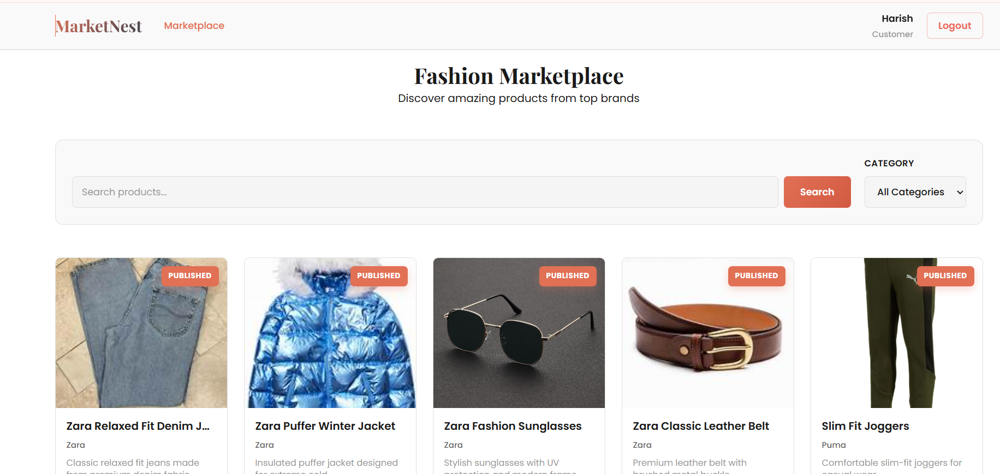
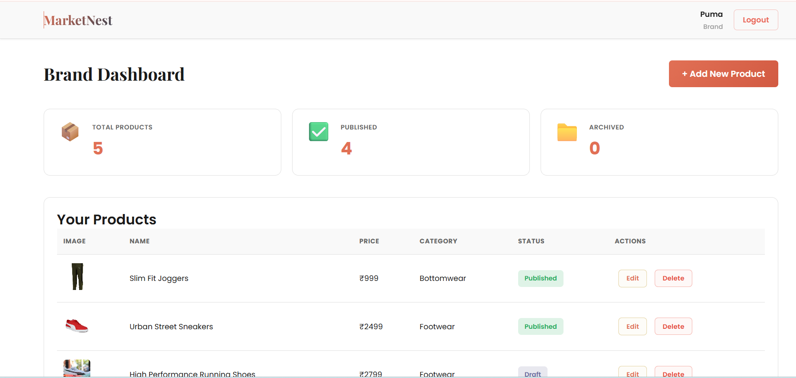
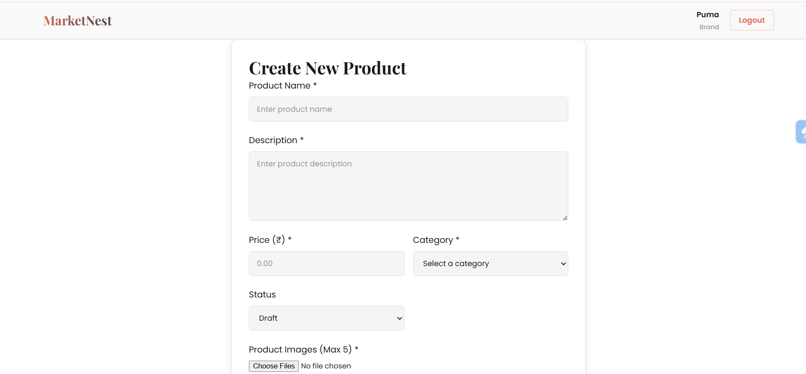

# MarketNest — Mini Fashion Marketplace

A full-stack fashion marketplace built with the MERN stack (MongoDB, Express.js, React.js, Node.js) supporting two user roles — **Brand** (Seller) and **Customer** (User).

**Live Links:**  
- Frontend: https://marketnest-frontend.vercel.app
- Backend: https://marketnest-backend-ou7y.onrender.com

## Demo Credentials

Brand Account
Email: puma@gmail.com  
Password: puma123

Customer Account
Email: harish@gmail.com  
Password: harish123

---

## Table of Contents

1. [Architecture](#architecture)
2. [Authentication Flow](#authentication-flow)
3. [Folder Structure](#folder-structure)
4. [Security Decisions](#security-decisions)
5. [Features](#features)
6. [Tech Stack](#tech-stack)
7. [Getting Started](#getting-started)
8. [Environment Variables](#environment-variables)
9. [API Endpoints](#api-endpoints)
10. [AI Tools Usage](#ai-tools-usage)

---

## Architecture

MarketNest follows a **client-server** architecture with clear separation of concerns:

```
┌─────────────────┐         ┌─────────────────────────────────┐        ┌───────────┐
│   React (Vite)  │ ──API──▶│  Express.js REST API            │ ──────▶│  MongoDB  │
│   Port 5173     │◀────────│  Port 3000                      │◀───── │  Atlas    │
└─────────────────┘         │  ┌───────────┐ ┌──────────────┐ │        └───────────┘
                            │  │ Middleware │ │ Controllers  │ │
                            │  │ (Auth,Role)│ │ (Auth,Prod.) │ │        ┌───────────┐
                            │  └───────────┘ └──────────────┘ │ ──────▶│Cloudinary │
                            └─────────────────────────────────┘        │ (Images)  │
                                                                       └───────────┘
```

**Design principles:**

- **Backend** uses Express.js with a layered architecture: Routes → Middleware → Controllers → Models. Each layer has a single responsibility. Async errors are caught uniformly using `express-async-handler` and a centralized error handler.
- **Frontend** uses React with Context API for state management (`AuthContext` for authentication, `ProductContext` for product operations). An Axios interceptor layer handles token injection, automatic token refresh on 401 errors, and proper `FormData` handling for file uploads.
- **Image storage** is offloaded to Cloudinary (via `multer-storage-cloudinary`), keeping the server stateless and enabling CDN-backed image delivery with automatic transformations (resize to 800×800, quality auto-optimization).
- **Database** uses MongoDB Atlas with Mongoose for schema validation, enforcing data integrity via enums, required fields, and referential relationships.

---

## Authentication Flow

MarketNest implements a **dual-token JWT strategy** with automatic silent refresh:

```
┌──────────┐                    ┌──────────┐                    ┌──────────┐
│  Client  │                    │  Server  │                    │ MongoDB  │
└────┬─────┘                    └────┬─────┘                    └────┬─────┘
     │  POST /auth/login             │                               │
     │  { email, password }          │                               │
     │──────────────────────────────▶│  Verify credentials           │
     │                               │──────────────────────────────▶│
     │                               │       User data               │
     │                               │◀──────────────────────────────│
     │                               │  Generate access token (15m)  │
     │                               │  Generate refresh token (7d)  │
     │                               │  Store refresh token in DB    │
     │   Access token (JSON body)    │──────────────────────────────▶│
     │   Refresh token (httpOnly     │                               │
     │   cookie)                     │                               │
     │◀──────────────────────────────│                               │
     │                               │                               │
     │  GET /products (expired)      │                               │
     │  Authorization: Bearer <exp>  │                               │
     │──────────────────────────────▶│  → 401 Unauthorized           │
     │◀──────────────────────────────│                               │
     │                               │                               │
     │  POST /auth/refresh           │                               │
     │  (cookie sent automatically)  │                               │
     │──────────────────────────────▶│  Verify refresh token         │
     │                               │  Match with DB record         │
     │   New access + refresh tokens │  Rotate refresh token         │
     │◀──────────────────────────────│──────────────────────────────▶│
     │                               │                               │
     │  Retry original request       │                               │
     │  with new access token        │                               │
     │──────────────────────────────▶│  → 200 OK                     │
     │◀──────────────────────────────│                               │
```

**Key implementation details:**

1. **Access Token** — Short-lived (15 min), stored in `localStorage`, sent via `Authorization: Bearer` header. Contains `userId` and `role` in payload.
2. **Refresh Token** — Long-lived (7 days), stored as `httpOnly`, `secure`, `sameSite: none` cookie. Contains only `userId`. Also stored in the database for server-side validation and revocation.
3. **Token Rotation** — On every refresh, both access and refresh tokens are regenerated and the old refresh token is replaced in the database, preventing replay attacks.
4. **Silent Refresh** — The Axios response interceptor automatically detects 401 errors, calls the `/auth/refresh` endpoint, and retries the original request with the new access token — invisible to the user.
5. **Logout** — Clears the refresh token from both the database and the cookie, and removes `localStorage` entries on the client.

---

## Folder Structure

```
MarketNest/
├── Backend/
│   ├── app.js                          # Entry point — Express server setup
│   ├── config/
│   │   ├── db.js                       # MongoDB Atlas connection
│   │   └── cloudinary.js              # Cloudinary + Multer storage config
│   ├── controllers/
│   │   ├── authController.js          # Register, Login, Logout, Refresh
│   │   └── productController.js       # CRUD, marketplace, dashboard stats
│   ├── middleware/
│   │   ├── authMiddleware.js          # JWT verification (verifyToken)
│   │   ├── roleMiddleware.js          # Role-based access (requireRole)
│   │   └── errorHandlerMiddleware.js  # Centralized error handling
│   ├── models/
│   │   ├── User.js                    # User schema (name, email, password, role, refreshToken)
│   │   └── Product.js                 # Product schema (name, desc, price, images, status, brand, category)
│   ├── routes/
│   │   ├── authRoutes.js              # /api/v1/auth/*
│   │   └── productRoutes.js           # /api/v1/products/*
│   ├── utils/
│   │   └── generateTokens.js          # JWT token generation helpers
│   ├── .env                           # Environment variables (not committed)
│   └── package.json
│
├── Frontend/
│   ├── src/
│   │   ├── api/
│   │   │   └── axios.js               # Axios instance with interceptors
│   │   ├── components/
│   │   │   ├── Header.jsx             # Navigation header (role-aware)
│   │   │   ├── ProtectedRoute.jsx     # Auth + role guard for routes
│   │   │   ├── ProductCard.jsx        # Product display card
│   │   │   ├── SearchBar.jsx          # Search input component
│   │   │   ├── CategoryFilter.jsx     # Category dropdown filter
│   │   │   └── LoadingSpinner.jsx     # Loading indicator
│   │   ├── context/
│   │   │   ├── AuthContext.jsx        # Auth state management
│   │   │   └── ProductContext.jsx     # Product operations state
│   │   ├── pages/
│   │   │   ├── Login.jsx              # Login page
│   │   │   ├── Register.jsx           # Registration page (with role selection)
│   │   │   ├── Dashboard.jsx          # Brand dashboard (stats + product list)
│   │   │   ├── CreateProduct.jsx      # Create product form
│   │   │   ├── EditProduct.jsx        # Edit product form
│   │   │   ├── Marketplace.jsx        # Customer marketplace (search, filter, paginate)
│   │   │   └── ProductDetail.jsx      # Single product view
│   │   ├── styles/                    # CSS Modules for each component/page
│   │   ├── App.jsx                    # Route definitions
│   │   ├── main.jsx                   # React entry point
│   │   └── index.css                  # Global styles
│   └── package.json
│
└── README.md
```

---

## Security Decisions

| Decision | Rationale |
|---|---|
| **Refresh token in httpOnly cookie** | Prevents JavaScript access, mitigating XSS-based token theft. The `secure` flag ensures HTTPS-only transmission, and `sameSite: none` enables cross-origin cookie delivery between the frontend and backend domains. |
| **Short-lived access tokens (15 min)** | Limits the damage window if an access token is compromised. Combined with automatic silent refresh, this provides seamless UX without exposing long-lived tokens. |
| **Refresh token rotation** | Every refresh generates a new refresh token and stores it in the database, invalidating the previous one. This prevents replay attacks with stolen refresh tokens. |
| **Server-side refresh token validation** | The refresh token is verified against the database record, enabling server-side revocation on logout or security events. |
| **Password hashing with bcrypt (salt rounds: 10)** | Industry-standard one-way hashing. Passwords are never stored or transmitted in plain text. |
| **Role-based middleware on every route** | Both `verifyToken` and `requireRole` middleware run on protected endpoints, ensuring a customer cannot access brand routes and vice versa. Frontend protection via `ProtectedRoute` is defense-in-depth. |
| **Ownership enforcement** | Product edit/delete operations verify `product.brand === req.user.userId`, preventing cross-brand modification even with a valid brand token. |
| **Environment variables for all secrets** | JWT secrets, database URI, Cloudinary credentials, and CORS origin are stored in `.env` and never hardcoded. `.env` is gitignored. |
| **Centralized error handler** | All errors flow through a single middleware that normalizes responses, avoiding accidental stack trace leakage in production. |
| **CORS with explicit origin** | Only the configured `CLIENT_URL` is allowed, preventing unauthorized cross-origin requests. `credentials: true` enables cookie-based auth. |

---

## Features

### Brand (Seller)
- Dashboard with product overview stats (total, published, archived)
- Create products as draft or published
- Upload up to 5 images per product (stored on Cloudinary)
- Edit own products only (ownership enforced on backend)
- Soft delete products (marks as archived, not permanently removed)

### Customer
- Browse published products from all brands
- View detailed product pages with image gallery
- Search products by name (server-side regex)
- Filter by category (Topwear, Bottomwear, Footwear, Accessories, Winterwear)
- Server-side paginated results (10 per page)

---

## Tech Stack

| Layer | Technology |
|---|---|
| Frontend | React 19, Vite 7, React Router 7, Axios, React Hot Toast |
| Backend | Node.js, Express 5, Mongoose 9, JWT, bcrypt |
| Database | MongoDB Atlas |
| Image Storage | Cloudinary (via multer-storage-cloudinary) |
| Auth | JWT (access + refresh tokens) |

---

## Getting Started

### Prerequisites
- Node.js (v18+)
- MongoDB Atlas account
- Cloudinary account

### Installation

```bash
# Clone the repository
git clone https://github.com/veerendra718/MarketNest.git
cd MarketNest

# Install backend dependencies
cd Backend
npm install

# Install frontend dependencies
cd ../Frontend
npm install
```

### Running locally

```bash
# Start the backend (from Backend/)
npm start        # or: npm run dev (with nodemon)

# Start the frontend (from Frontend/)
npm run dev
```

The backend runs on `http://localhost:3000` and the frontend on `http://localhost:5173`.

---

## Environment Variables

Create a `.env` file in the `Backend/` directory:

```env
PORT=3000
MONGO_URI=mongodb+srv://<username>:<password>@<cluster>.mongodb.net/<dbname>
ACCESS_SECRET=<your-access-token-secret>
REFRESH_SECRET=<your-refresh-token-secret>
CLOUDINARY_CLOUD_NAME=<your-cloud-name>
CLOUDINARY_API_KEY=<your-api-key>
CLOUDINARY_API_SECRET=<your-api-secret>
CLIENT_URL=http://localhost:5173
NODE_ENV=development
```

---

## API Endpoints

### Authentication (`/api/v1/auth`)

| Method | Endpoint | Description | Auth |
|---|---|---|---|
| POST | `/register` | Register a new user (brand/customer) | No |
| POST | `/login` | Login and receive tokens | No |
| POST | `/refresh` | Refresh access token using cookie | Cookie |
| POST | `/logout` | Logout and invalidate refresh token | Cookie |

### Products (`/api/v1/products`)

| Method | Endpoint | Description | Auth | Role |
|---|---|---|---|---|
| GET | `/` | Browse marketplace (search, filter, paginate) | Token | Customer |
| GET | `/my` | Get brand's own products | Token | Brand |
| GET | `/dashboard` | Get brand's dashboard stats | Token | Brand |
| POST | `/` | Create a new product (with images) | Token | Brand |
| PUT | `/:id` | Update a product (ownership enforced) | Token | Brand |
| DELETE | `/:id` | Soft delete a product (ownership enforced) | Token | Brand |
| GET | `/:id` | Get single product details | Token | Any |

---

## AI Tools Usage

AI coding assistants were used during development for:

- **Debugging** — Identifying issues such as environment variable load-order problems and async error handling patterns.
- **Best practices** — Reviewing authentication flow implementation (token rotation, cookie security flags) and suggesting security improvements.
- **Documentation** — Assisting with README structure and content organization.

All AI-generated code was reviewed, understood, and adapted to fit the specific project requirements.

## Screenshots

### Marketplace


### Brand Dashboard


### Create Product

